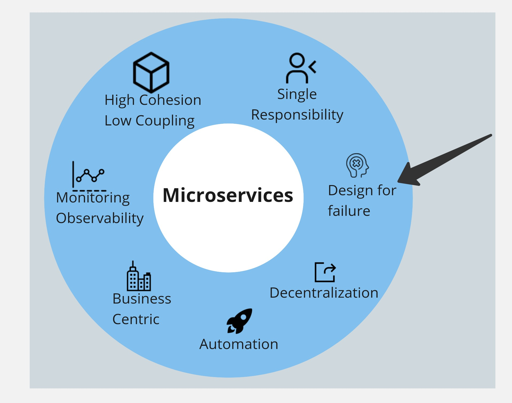
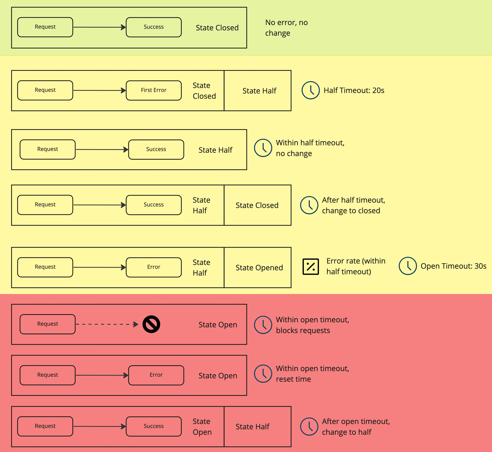
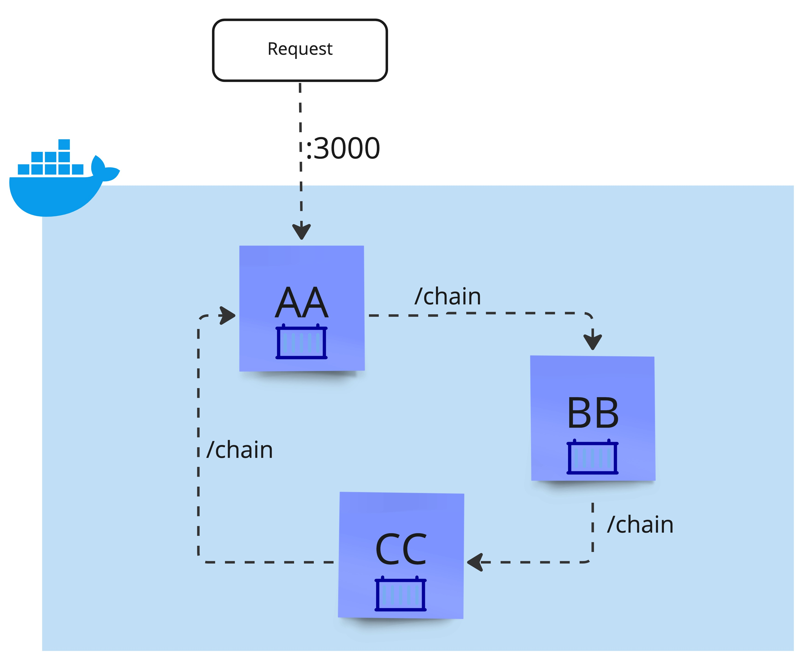
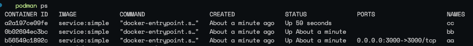
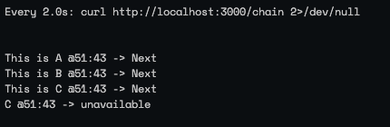
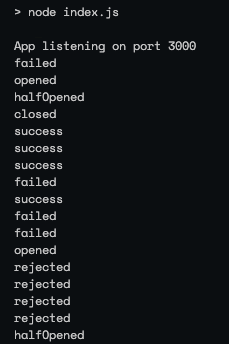

# Circuit-breaker project

## Introduction

Resilience in the **micro-services** world is a concept that should be as relevant as speed, scalability, portability, etc. but it is sometimes overlooked when designing solutions. This is because many times the concerns around network, availability, stability that would be a top priority in traditional distributed systems, seem to no longer be an issue when working with technologies like public clouds or Kubernetes.

However, EVEN if these issues are less common and the mentioned platforms have many features to reduce the possibilities or impact, in the end are in no way 100% guarantied or have some kind of restrictions. A very simple example of this is when connecting to 3rd party systems, that could not be reliable. Our systems need to be prepared and fail gracefully.

As we can see in the figure, we are describing some of the important principles we need to take into account such as cohesion and coupling, responsibility, metrics, observability, etc. when designing micro-services.



## Introducing the circuit-breaker:

It is pattern, as well as a state machine, which has 3 states (open, half-opened, and closed) that represent the flow and confidence of communication throughout the services. It does all this with the configuration of relevant limits, thresholds and timeouts with which it monitors the responses of subsequent requests from a service to another.

Depending on the implementation, the states may change names or events

The communication is managed depending on the errors. If the “target” service fails a particular number of times in a certain amount of time, the “source” service will temporarily stop sending requests. All these timeouts and rates are parameters that can be adapted to each service's expected behaviour. 

The correct calculations of this parameters and rates are a very interesting and extensive topic

If we watch each case depending on the state we will see the following:



1. For the first case (marked in green), if there is no error, the circuit remains closed with no changes
2. The second case, beginning in yellow, when we find the first error in the request, the state will change to half and begin the timeout related to this state
3. In the  third case, if subsequent requests result in success, it still will wait for the timeout to return to the “Closed” state
4. For the forth case, after the timeout has been reached, subsequent success requests will return the circuit to closed state
5. However, in the fifth case, if consecutive errors happen within the timeout and we reach a defined error rate (or minimum error requests), the circuit will change to “Open State”
6. We are now in the red area in this state, for the sixth case, a new timeout will begin, that all subsequent request will be blocked so, they won't reach the target service
7. After this timeout in the seventh case, if subsequent errors occur, the “open timeout” will start over, and block again
8. Finally, in the last case, if the subsequent request after the timeout resolves, is succesful, the state will change to half and it's own timeout will begin again

## Previous Demos

[GitHub - casimon-rh/gs-nodejs-demo1](https://github.com/casimon-rh/gs-nodejs-demo1)

## Second Demo

For the second demo we will work with a library called Opossum, it works essentially like the definitions we made before but has a longer documented schema and is accessible to download from npm.

So we define a generic service that we can later chain in requests with different instances (containers) with slight differences. Note that the number of services is arbitrary, we can have as little as 2 chained services, or as many as we like to test.

Other related libraries involved in this generic service are express and axios, that can help us with REST client-server interactions.



```
.
├── Dockerfile
├── index.ts
├── package-lock.json
├── package.json
├── run.sh
└── tsconfig.json
```

The files we have in the repository are standard (index.ts, package*.json, tsconfig.json) and 2 extra related to the container definition and run scripts.

```docker
FROM node:16
WORKDIR /app
COPY package* .
RUN npm i
COPY . .
RUN npm run build
CMD npm start
```

As we can see the container definition uses a base from nodejs on tag 16, defines a workdir in /app directory, runs the installation of packages (with the package*.json) and after that,i t  copies the remaining files into the container, build the typescript source to turn them into js and execute them.

```
dist
node_modules
Dockerfile
.dockerignore
index.js
run.sh
```

Note: is also relevant for container definition, the exclusions of unwanted files into the container (particularly in the `COPY . .` command)

Now, the typescript code:

```tsx
import express, { Express, Request, Response } from 'express'
import axios, { AxiosResponse } from 'axios'
import CircuitBreaker from 'opossum'

const app: Express = express()
app.listen(3000, () => console.log('App listening on port 3000'))
```

First we have the imports and the base of the express application. As we can see we are using both objects and types from the 3 libraries, express, axios and opossum.

```tsx
const jumps = process.env.JUMPS || 6
const throwError = () => Math.random() > .6 && process.env.INJECT_ERR === '1'
const m = `hello from ${process.env.ID}\n`
const curtime = () => `${new Date().getMinutes()}:${new Date().getSeconds()}`
const message = (data: string) =>
  `\nThis is ${process.env.ID} @${curtime()} -> Next ${data}`
const errmsg = () =>
  `\n${process.env.ID} @${curtime()} -> unavailable`
```

Next we define some variables that will be useful later, including messages, the jump limit, and the random condition in which to inject the 502 error

```tsx
const breakerOptions = {
  timeout: 300, 
  errorThresholdPercentage: 50, 
  resetTimeout: 10000 
}

const chain = (endpoint: string): Promise<string> =>
  new Promise((resolve, reject) =>
    axios.get(endpoint)
      .then((response: AxiosResponse) => {
        resolve(message(response.data))
      }).catch((err: any) => {
        reject(message(err.response.data))
      })
  )

const breaker = new CircuitBreaker(chain, breakerOptions)
```

Now we have the definition of the circuit breaker, the options,the intended promise method and the instance.

The parameters we have are the following:

- timeout: Is the definition of maximum wait time in the execution otherwise trigger an error, it is different from the timeouts of each state
- errorThresholdPercentage: The acceptable percentage of errors (rate)
- resetTimeout: The timeout for the opened state

```tsx
app.get('/', (req: Request, res: Response) => res.send(m))
app.get('/chain', async (req: Request, res: Response) => {
  const count = (parseInt(`${req.query['count']}`) || 0) + 1
  const endpoint = `${process.env.CHAIN_SVC}?count=${count}`

  if (throwError())
    return res.status(502).send(message(errmsg()))
  if (count >= jumps)
    return res.status(200).send('\nLast')
  try {
    const response = await breaker.fire(endpoint)
    res.status(200).send(response)
  } catch (error) {
    res.status(200).send(error)
  }
})
```

Next we have the definition of the endpoints, including the “/chain” 
There we grab the count query parameter, in order to limit the chain to specific jumps

If the throw error condition is met, the 502 error will be sent

When the jump limit is met, the message “last”  is sent in the response

If neither the error, nor the jump limit occurs, the circuit-breaker is fired and we await for the response or the error.

```tsx
breaker.on("fallback", () => console.log('fallback'))
breaker.on("success", () => console.log("success"))
breaker.on("failure", () => console.log("failed"))
breaker.on("timeout", () => console.log("timed out"))
breaker.on("reject", () => console.log("rejected"))
breaker.on("open", () => console.log("opened"))
breaker.on("halfOpen", () => console.log("halfOpened"))
breaker.on("close", () => console.log("closed"))
```

Finally we have the log definition for all the events related to the circuit-breaker object

In order to run the tests, we have prepared the `run.sh` script

```bash
#!/bin/bash
docker build --compress -t service:simple .
docker network create chains 1>/dev/null 2>/dev/null
docker rm -f aa 1>/dev/null 2>/dev/null
docker rm -f bb 1>/dev/null 2>/dev/null
docker rm -f cc 1>/dev/null 2>/dev/null

docker run --network=chains -p 3000:3000 -e JUMPS=3 \
  -e ID=A -e CHAIN_SVC=http://bb:3000/chain \
  --name aa -d docker.io/library/service:simple

docker run --network=chains -e JUMPS=3 \
  -e ID=B -e CHAIN_SVC=http://cc:3000/chain \
  --name bb -d docker.io/library/service:simple

docker run --network=chains -e JUMPS=3 \
  -e ID=C -e CHAIN_SVC=http://aa:3000/chain \
  -e INJECT_ERR=1 --name cc -d docker.io/library/service:simple
```

The docker objects we are creating are the following:

- Container image with tag service:simple
- Container network to share with all containers
- Delete the containers if previously created
- Start 3 instances of the same image, with different env variables each defining the chain endpoint as well as a common JUMP variable as a limit

Note the differences between each container, only the “A” service has a published port (3000), and only the “C” container has the INJECT_ERR va

After we run the command we have the following containers created:



And to try the endpoint we can use the next command:

```bash
watch "curl http://localhost:3000/chain 2>/dev/null"
```

With the following response results:



Now if we check the log of the "BB” container, in order to see the state of the circuit, when it reaches the error rate it opens and rejects requests; and after the timeout is reach it will return to half state



## Next Demos

[GitHub - casimon-rh/gs-nodejs-demo3](https://github.com/casimon-rh/gs-nodejs-demo3)

## Next Steps

As we can see, the Circuit Breaker Patter can help us manage the errors in the communication of micro-services, as well as dosing the interaction to unreliable destinations, both to avoid further saturation of the target as well as even controlling costs in error cases.

For the next steps, we could explore additional patterns and practices, such as Retry pattern, Bulkhead pattern and Chaos Engineering practice, that together with circuitbreaking, will improve even more the application's  reliability.

Another technology related is Istio, as well as the concept of Service Mesh, where we could achieve many of these patterns and implementations, not in the code, but in the immediate infrastructure, making the implementation potentially agnostic.